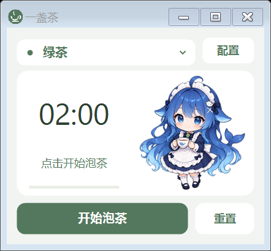
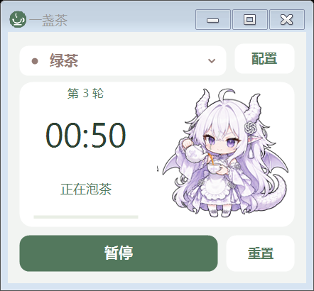
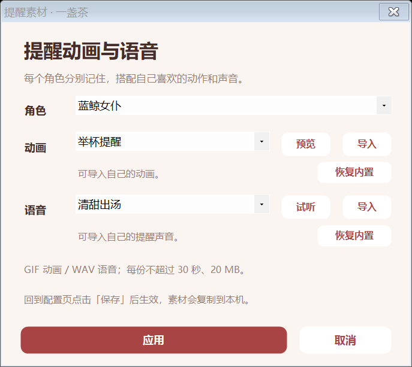
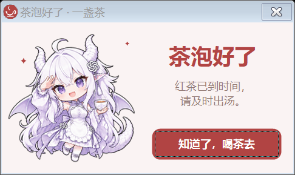
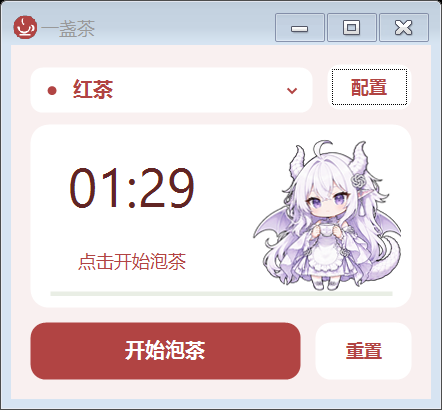

# 一盏茶 · Windows 泡茶计时

一个小巧的 Windows 桌面泡茶计时器：选茶，点击开始，到时弹窗提醒。



## 功能

- 绿茶、红茶、乌龙、白茶、熟普洱和花草茶六种预设。
- 每种茶的时间分别保存，支持 1 秒至 99 分 59 秒。
- 每种茶可设置「每轮 +秒」，再泡一杯时累加时间，并显示当前轮次；0 表示不增加。
- 紧凑主窗口，可拖动调整大小，并记住窗口尺寸。
- 茶类对应不同配色；主界面只保留选茶、倒计时和基础按钮。
- 独立配置页设置时间、提示音、置顶、角色和动画。
- Q 版蓝鲸女仆、GPT 原创茶娘和参考图版 GPT 龙娘，包含待机、泡茶、完成三种状态。
- 暂停、继续、重置、再泡一杯；最小化后继续计时。
- 到时置顶弹窗显示所选泡茶娘，配合系统托盘通知和可关闭的提示音。
- 提醒时播放 2～3 秒角色短动画和本地生成的短语音；配置页可关闭语音或试听。
- 每个角色有举杯和专属动作两种动画，共 6 段；内置 4 段提醒语音，支持随机播放。
- 配置页的「动画与语音」支持按角色选择素材、预览 / 试听、导入自定义 GIF / WAV，以及恢复内置素材。
- 睡眠期间到期，会在唤醒后补发提醒。

## 使用

从仓库 Releases 下载 Windows 压缩包，解压后双击 `一盏茶.exe`。
程序使用 Windows 自带的 .NET Framework；Windows 10 / 11 无需安装 Python 或 Node。
角色素材已经嵌入 EXE，单独复制程序也可以使用。

点击茶类名称选择茶，倒入热水后点击「开始泡茶」。点击「配置」可修改每种茶的时间，点击「保存」生效。
计时中修改配置不会打断当前计时，新的时间用于下一次泡茶。

配置页的「每轮 +秒」分别记住每种茶的增量。例如首轮 30 秒、每轮增加 10 秒，第二轮为 40 秒、第三轮为 50 秒。点击「再泡一杯」进入下一轮，暂停 / 继续保留当前轮；重置、切换茶类或重新启动程序后从第一轮开始。每轮最多 99 分 59 秒，达到上限后不再增加。



提醒弹窗跟随配置页的角色选择、「显示泡茶娘」和「播放动画」设置。关闭动画会保留静态角色，隐藏角色后仍有文字提醒。
主窗口和提醒弹窗使用更大的角色展示区域，主窗口调整大小时角色也会随之缩放。
短动画在弹窗打开时播放一次，结束后停在最后一帧。「提示音」控制全部提醒声音；勾选「语音提醒」播放当前角色选择的声音，默认是「茶泡好了，记得出汤哦」，取消后使用原提示音。配置页的「试听」按钮可直接试听当前角色的短语音。
动画与语音已提前生成并嵌入 EXE，平时提醒时直接播放，无需启动 ComfyUI、TTS 服务或占用 GPU。

点击配置页的「动画与语音」为每个角色选择动作和声音。蓝鲸女仆新增「挥手迎茶」、原创 GPT 茶娘新增「俏皮眨眼」、龙娘新增「摇尾招呼」；随机播放会在该角色的两种动画或四种语音之间选择。
「导入」可替换为自己的 GIF 动画或 PCM WAV 语音，点击「应用」后，再回到主配置页点击「保存」。取消配置不会改变已有选择。「恢复内置」分别恢复原来的动画或声音。
自定义素材在保存时复制到 `%LOCALAPPDATA%\YiZhanCha\media`，不依赖原文件的位置。每份素材不超过 20 MB、30 秒；GIF 支持 2～600 帧，宽高不超过 2048 像素；WAV 支持单 / 双声道的 8 / 16 位 PCM。
自定义素材无法读取时，提醒会使用原有内置素材。内置素材随 EXE 携带；自定义素材与配置保存在本机应用数据目录中。





最小化后双击系统托盘茶杯图标可恢复。计时中点击关闭会收起到托盘；右键托盘选择「退出（停止计时）」可彻底退出。

设置保存在 `%LOCALAPPDATA%\YiZhanCha\settings.xml`。程序运行时不联网。
更多说明见 [使用说明.txt](使用说明.txt)。

## 从源码编译

在项目目录的 PowerShell 中执行：

```powershell
.\build.ps1
```

编译脚本使用 Windows .NET Framework 自带的 C# 编译器，输出 `一盏茶.exe`。
源码为 `TeaTimer.cs`、`CompactUi.cs`、`ReminderMedia.cs`、`MediaLibrary.cs`、`MediaSettingsUi.cs`，图像、短动画和语音资源位于 `assets/`。

如果系统禁用 PowerShell 脚本，双击 `build.cmd` 也能编译，输出 `TeaTimer.exe`，无需修改系统执行策略。

## 验证

```powershell
$test = Start-Process '.\一盏茶.exe' -ArgumentList '--self-test', 'verification' -Wait -PassThru
Get-Content '.\verification\test-results.txt'
```

自检覆盖计时边界、暂停继续、单次提醒、睡眠恢复、六种预设、每种茶的轮次累加与上限、重置与换茶恢复首轮、运行中修改增量、提醒角色切换、静态与隐藏提醒、弹窗关闭释放动画、DPI 布局、配置校验、窗口缩放、设置保存、重开恢复及旧配置迁移，并生成界面预览。素材自检覆盖六段动画、四段语音、按角色保存选择、导入与复制、移走原文件、无效素材拒绝、损坏或缺失素材回退，以及恢复内置素材。

## 角色素材

三张角色图均通过内置 imagegen 工具生成，含透明背景和三个动作状态，可在配置页切换，选择会自动记住。
蓝鲸女仆参考了蓝发鲸鱼女仆的社区形象元素。「GPT 茶娘（原创）」是银白发、圆眼镜、薄荷绿女仆装的原创设计。「GPT 龙娘」按用户提供的白发、紫瞳、龙角、龙翼和龙尾参考图生成，保留原有角色供选择。
完整提示词与来源说明见 [素材生成记录](assets/生成记录.txt) 和 [龙娘提示词](assets/龙娘提示词.txt)。



## 本地生成提醒素材

提醒短动画由本机 ComfyUI 0.38.2 的 MiniMax H3 图生视频工作流生成，角色图提供首帧，使用 20 步基础模型。输出为 384×384、24 FPS、56 帧，约 2.33 秒，抠除纯绿背景后转换为透明 GIF，供 WinForms 直接播放。完整 API 工作流位于 `workflows/`，生成与导出脚本位于 `scripts/`。

短语音使用 TK 已有的 Qwen3-TTS 1.7B CustomVoice GPU 环境和 Serena 声线。生成记录见 `assets/voice-generation.json`。模型与 Python 环境不随程序打包。
新增语音使用 Vivian 与 Serena 两种声线，生成记录见 `assets/voice-pack-generation.json`。新增动画记录见 `assets/extra-animation-generation.json`，完整提示词位于 `workflows/extra-*.api.json`。

复现时先启动本地 ComfyUI，并保证工作流中的模型名称已安装；脚本默认服务地址为 `http://127.0.0.1:8189`，输入与输出目录为当前电脑的 ComfyUI 共享目录，可通过参数更改。本机使用默认动态显存管理，无需修改 ComfyUI 安装文件。

```powershell
python scripts/generate-reminder-animation.py maid
# 等待 ComfyUI 生成完毕后导出；其他角色使用 gpt 或 dragon。
python scripts/export-reminder-animation.py maid
# 新增角色专属动作，生成完成后再导出。
python scripts/generate-reminder-animation.py maid --variant extra
python scripts/export-reminder-animation.py maid --variant extra
# 使用 TK 的现有环境生成短语音。
& G:\codex\TK\.tools\qwen-tts-gpu-venv\Scripts\python.exe scripts/generate-reminder-voice.py
# 一次生成三段新增语音。
& G:\codex\TK\.tools\qwen-tts-gpu-venv\Scripts\python.exe scripts/generate-reminder-voice.py --pack
```

生成与导出脚本需要 Pillow、NumPy；重新编译后即可更新程序内嵌的提醒素材。

## 泡茶时间参考

默认时间是普通杯泡的可调整起点；盖碗、功夫泡和不同茶叶请按包装说明调整。
绿茶、红茶、乌龙、白茶和花草茶参考 [Twinings 杯泡指南](https://twiningsusa.com/pages/how-to-brew-the-perfect-cup-of-tea)，熟普洱参考 [Harney & Sons Pu-Erh](https://www.harney.com/products/pu-erh)。
